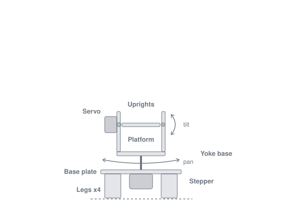

# Tilt-Pan-Platform

A mini Arduino project for beginners. It provides the parts list, the code for the
Arduino IDE, and the cardboard cutouts.

The build is a two-axis pointing rig. A stepper motor rotates the base (pan) while a
servo tilts a platform slung between two uprights. Both axes act on the same
platform, so whatever you mount on it — a phone, a laser pointer, a small camera —
can be aimed in two dimensions. A potentiometer sets the tilt angle, three buttons
drive the pan, and a 16x2 LCD shows both angles live.

### Electronics/parts

- Arduino Uno R4 Minima
- 28BYJ-48 stepper motor (5V, 4-phase, unipolar)
- ULN2003 stepper driver board
- SG90 micro servo (9g)
- 16x2 character LCD, HD44780-compatible, with I2C backpack
- 10k linear rotary potentiometer (B10K)
- Tactile push button, 6x6 mm momentary — x3
- Solderless breadboard
- Jumper wires, male-to-male and male-to-female
- USB-C cable

Any HD44780-compatible character LCD on an I2C backpack will work here — 16x2, 20x4,
whichever you have. The `hd44780` library detects the address either way. A graphic
LCD, an OLED, or a bare parallel LCD with no backpack will not work without changing
the code.

### Build

- Cardboard (1-3 mm thickness)
- Hot glue gun and glue sticks
- Scissors or craft knife
- Ruler
- Compass (optional)

## Wiring

| Arduino pin | Connects to |
|---|---|
| 2 | Button 1 to GND — pan left |
| 3 | Button 2 to GND — pan right |
| 4 | Button 3 to GND — return to home |
| 6 | Servo signal (orange/yellow) |
| 8 | ULN2003 IN1 |
| 9 | ULN2003 IN2 |
| 10 | ULN2003 IN3 |
| 11 | ULN2003 IN4 |
| A0 | Potentiometer wiper (centre pin) |
| A4 | LCD SDA |
| A5 | LCD SCL |
| 5V | ULN2003 power pad, servo red, potentiometer end pin, LCD VCC |
| GND | ULN2003 GND pad, servo brown/black, potentiometer other end pin, LCD GND, all button legs |

The stepper plugs into the white socket on the ULN2003 board — it only fits one way.

Buttons use the microcontroller's internal pull-up resistors, so no external
resistors are needed. One leg goes to the pin, the other to ground.

## Libraries

| Library | Source |
|---|---|
| `hd44780` by Bill Perry | Install via Library Manager |
| `Servo` | Bundled with the Arduino IDE |
| `Stepper` | Bundled with the Arduino IDE |

`hd44780` is used instead of `LiquidCrystal_I2C` because it auto-detects the
backpack's I2C address, which sidesteps the usual 0x27 versus 0x3F guessing game.

## Gotchas

**The stepper pin order in the code is not sequential, and that is deliberate.**
The `Stepper` constructor is called with `8, 10, 9, 11`, even though the driver's
IN1-IN4 go to Arduino pins 8, 9, 10, 11 in order. The library expects the coils in
IN1, IN3, IN2, IN4 sequence. Wire the board in numerical order and leave the code
alone — "correcting" it makes the motor buzz without turning.

**Watch the power budget.** The stepper draws current continuously, including when
it is holding position rather than moving. Running the stepper, servo and LCD
together can pull more than USB supplies through the board's regulator. A dimming
LCD plus a buzzing motor is the signature of a sagging 5V rail. The fix is to feed
the ULN2003 from a separate 5V supply with the grounds tied together.

**Both pivot points must sit at the same height.** The servo shaft on one upright
and the free pivot on the other are both 35 mm above the yoke base. A mismatch makes
the platform bind.

## Cut list

All dimensions in millimetres. If you are using 1 mm cardboard, laminate it to the
layer counts shown, with the corrugation running crosswise between plies. Thicker
cardboard needs fewer layers.

| Part | Qty | Size | Cutouts |
|---|---|---|---|
| Base plate | 1 | 100 x 100 || 30 mm dia hole, centred |
| Legs | 4 | 30 x 20 | — |
| Yoke base | 1 | 60 x 60 | 5 mm dia hole, centred, with a 20 x 20 reinforcing patch |
| Upright A | 1 | 50 x 40 | 22 x 12 servo slot, shaft centre 35 mm from bottom |
| Upright B | 1 | 50 x 40 | 2 mm dia pivot hole, 35 mm from bottom |
| Platform | 1 | 48 x 60 | — |

The uprights glue flush to the outer edges of the yoke base, leaving a 52 mm gap for
the 48 mm platform. Mount the servo on the outside of upright A so its body cannot
foul the platform.

Do not screw into the servo's mounting tabs — cardboard tears. Cut the slot about
1 mm undersize, press-fit the servo, and hot glue it from both sides.

## Controls

| Input | Effect |
|---|---|
| Potentiometer | Sets tilt angle, 0-180 degrees, with a 2 degree deadband |
| Button on pin 2 | Pans left while held, down to -90 degrees |
| Button on pin 3 | Pans right while held, up to +90 degrees |
| Button on pin 4 | Walks pan back toward 0 while held |

Nothing moves on its own. Every motion is something you do.

The pan limits exist so that the servo cable running up to the platform cannot wind
itself around the rig.

Diagram of the finished product
  

## Files

- `pan_tilt.ino` — the sketch

## Possible upgrades

- Swap the buttons for a second potentiometer so pan and tilt both use dials
- Add an IR receiver and drive it from a remote
- Store preset positions and recall them with a button
- Sweep automatically to scan a room

## License

MIT
